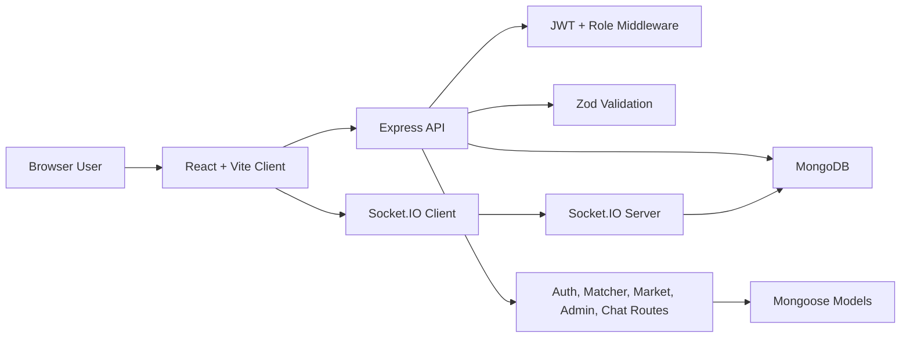
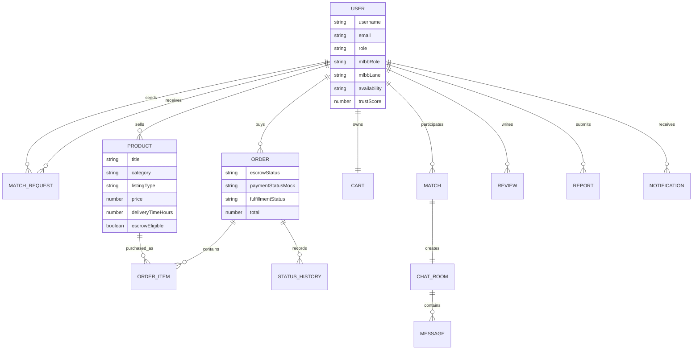
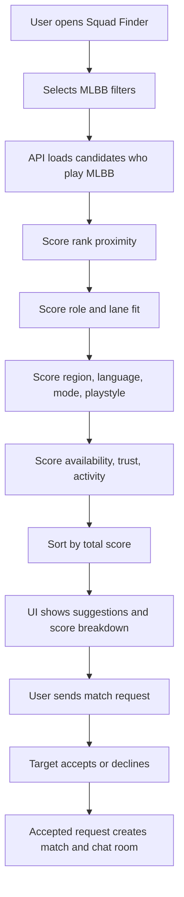
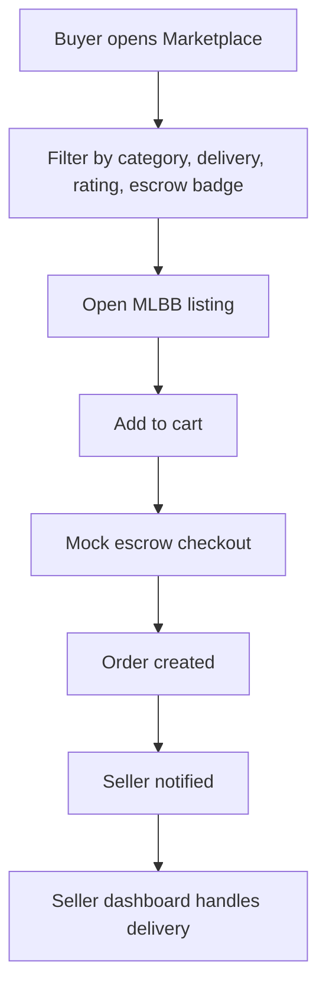
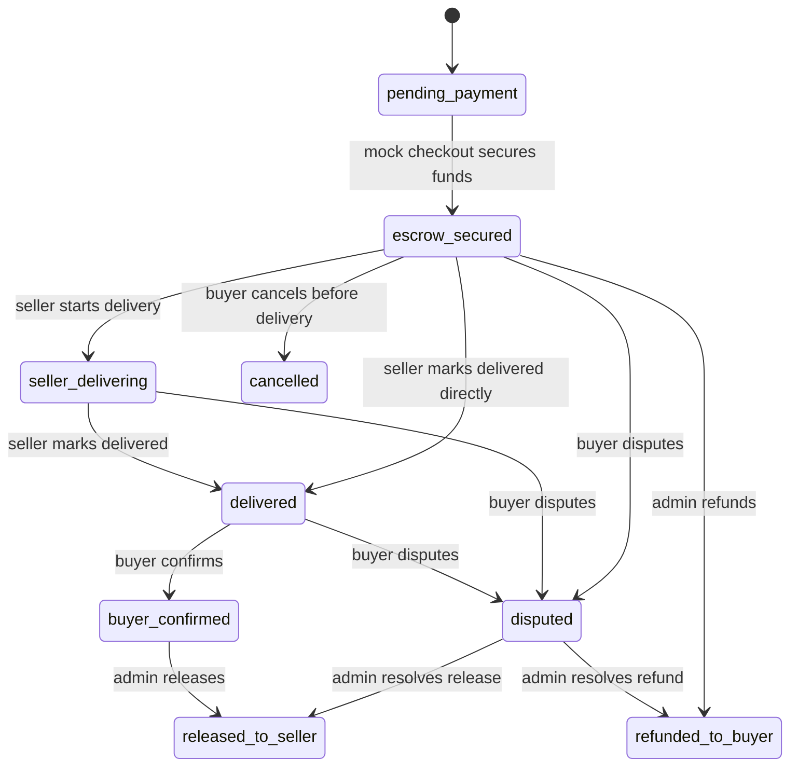

# Project Report: MLBB Nexus

## Project Title

Mobile Legends: Bang Bang Game Matcher and Marketplace Platform with Mock Escrow Workflow

## Purpose

This project demonstrates a full-stack gaming platform focused on Mobile Legends: Bang Bang. It helps players find better teammates and lets users buy or sell MLBB-related services or digital products through a mock escrow workflow.

This is a university practicum demo. The escrow feature is not real payment escrow.

## Existing Project Evidence

The submitted code already contained:

- React/Vite frontend
- Express/TypeScript backend
- MongoDB/Mongoose database models
- JWT authentication
- User roles
- Marketplace products, cart, checkout, and orders
- Matchmaking, match requests, matches, and chat
- Seller and admin pages
- Seed data and tests

The redesign improved these existing parts instead of rewriting the project from zero.

## Main Features

### MLBB Matchmaking

Players can find teammates using:

- MLBB rank
- MLBB role
- MLBB lane
- language
- region
- playstyle
- availability
- trust score
- recent activity

### Marketplace

Users can browse MLBB listings with:

- categories
- seller rating
- trust score
- delivery time
- mock escrow badge
- product/service type
- filters and sorting

### Mock Escrow Workflow

The system supports these statuses:

- `pending_payment`
- `escrow_secured`
- `seller_delivering`
- `delivered`
- `buyer_confirmed`
- `released_to_seller`
- `disputed`
- `refunded_to_buyer`
- `cancelled`

## Demo Accounts

- Admin: `admin@gamematcher.gg` / `Password123!`
- Seller: `seller@gamematcher.gg` / `Password123!`
- User: `user@gamematcher.gg` / `Password123!`

## Architecture Diagram

## ERD Diagram

## Matchmaking Flow

## Marketplace Flow

## Escrow Flow

## Security Review

The project improves security through:

- JWT protected routes
- role-based access control
- seller ownership checks on seller order actions
- buyer ownership checks on buyer order actions
- admin-only release/refund/dispute resolution
- Zod validation for request bodies
- ObjectId validation for marketplace route parameters
- MongoDB indexes for common query paths

## Limitations

- Mock escrow is not real escrow.
- No real payment gateway is connected.
- No regulated fund custody exists.
- Trust score is demo data.
- MLBB profile data is user-entered, not officially verified.
- Delivery proof upload is not implemented.

## Future Improvements

- Integrate a real payment provider after legal/compliance review.
- Add verified seller onboarding.
- Add delivery proof uploads.
- Add dispute evidence and admin audit export.
- Add rate limiting and abuse monitoring.
- Tune matchmaking with accepted match outcomes.
- Add official MLBB profile verification if an approved API is available.

## Final Explanation For Teacher

This project demonstrates how an existing game matcher and marketplace can be redesigned into an MLBB-specific platform. The technical focus is on practical full-stack engineering: schema design, API validation, route security, role-based workflows, UI redesign, seed data, and automated tests.

The mock escrow workflow is intentionally labeled as a simulation. It is valuable for a university project because it demonstrates order state management and role separation without pretending to be a real financial escrow system.
